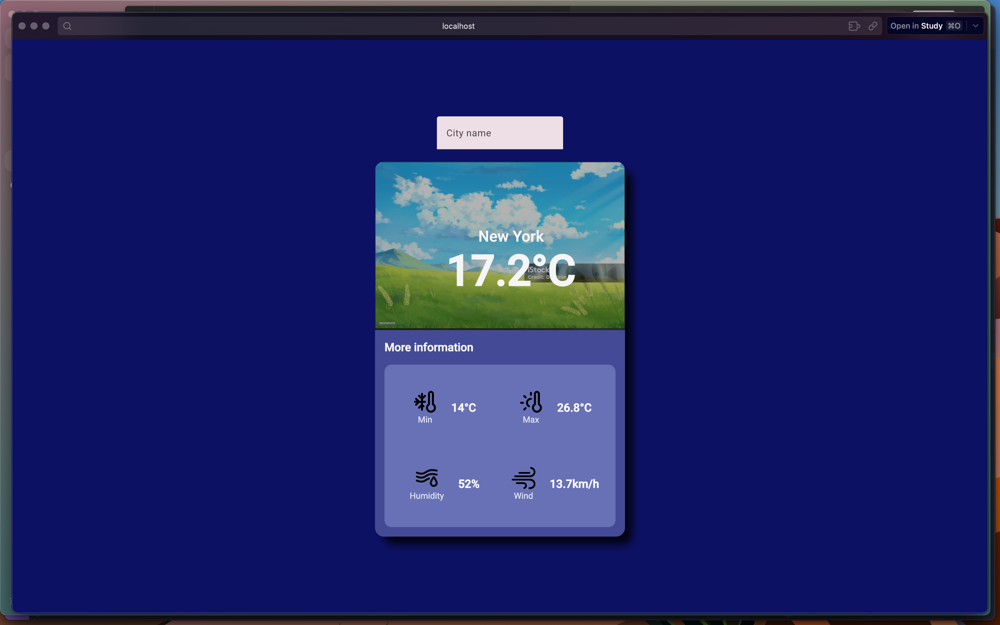

# Angular Weather App


A clean and responsive weather application built with Angular and Express.js. Features real-time weather data with dynamic backgrounds based on time of day.



## Features

-   **Current Weather Data** - Real-time weather information
-   **Location Details** - City display
-   **Temperature Range** - Daily minimum and maximum temperatures
-   **Weather Conditions** - Humidity and wind speed data
-   **Dynamic Backgrounds** - Changes based on local time of day
-   **Material Design** - Clean UI using Angular Material components
-   **API Protection** - Rate-limited backend with secure API key handling

## Project Structure

```
angular-weather-app/
├── angular-weather/          # Frontend Angular application
└── angular-weather-api/      # Backend Express.js API
```

## Prerequisites

-   Node.js (Latest LTS version recommended)
-   Angular CLI
-   WeatherAPI account and API key

## Installation

### Backend Setup (Express API)

1. Navigate to the backend directory:

    ```bash
    cd angular-weather-api
    ```

2. Install dependencies:

    ```bash
    npm install
    ```

3. Create a `.env` file in the backend root:

    ```env
    PORT=3000
    API_KEY=your_weatherapi_key_here
    API_URL=https://api.weatherapi.com/v1
    ```

4. Start the backend server:
    ```bash
    node index.js
    ```

### Frontend Setup (Angular)

1. Navigate to the frontend directory:

    ```bash
    cd angular-weather
    ```

2. Install dependencies:

    ```bash
    npm install
    ```

3. Start the development server:
    ```bash
    ng serve
    ```

The application will be available at `http://localhost:4200`

## API Endpoints

### Backend API

-   `GET /api/weather` - Retrieves weather data (rate-limited)

## Environment Variables

### Backend (.env)

| Variable  | Description            | Example                         |
| --------- | ---------------------- | ------------------------------- |
| `PORT`    | Backend server port    | `3000`                          |
| `API_KEY` | WeatherAPI.com API key | `your_api_key`                  |
| `API_URL` | WeatherAPI base URL    | `https://api.weatherapi.com/v1` |

## Technologies Used

-   **Frontend**: Angular, TypeScript, Angular Material
-   **Backend**: Express.js, Node.js
-   **API**: WeatherAPI.com
-   **Security**: dotenv for environment variables, rate-limiter for API protection

## Getting Your API Key

1. Visit [WeatherAPI.com](https://www.weatherapi.com/)
2. Create a free account
3. Copy your API key from the dashboard
4. Add it to your `.env` file in the backend directory

## Development

This project was created as a learning exercise for Angular development, demonstrating:

-   Angular component architecture
-   HTTP client usage
-   Material Design implementation
-   Express.js backend integration
-   API security best practices

## License

This project is free to use for everyone. Feel free to modify and distribute as needed.

## Contributing

This is a learning project, but suggestions and improvements are welcome!
