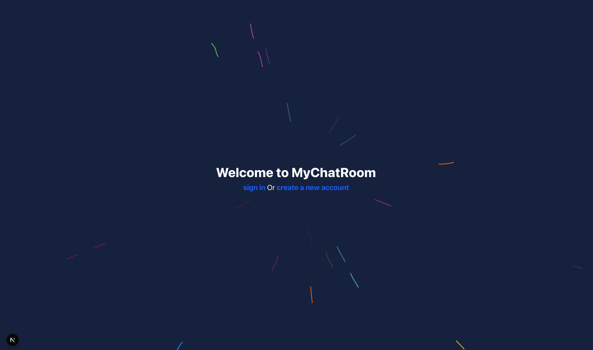

# Web Chat Application


A simple real-time chat application built with SignalR for WebSocket communication. This project serves as a testing ground for exploring SignalR functionality and real-time messaging capabilities.

<!-- Add screenshot placeholder -->



## Overview

This is a straightforward chat application that demonstrates real-time communication using SignalR. The project focuses on implementing basic chat features and serves as an experimental platform for learning SignalR integration patterns.

<!-- Add demo gif placeholder -->


## Features

-   Real-time messaging with SignalR
-   User authentication with ASP.NET Core Identity
-   Message persistence with Entity Framework Core
-   Dockerized deployment
-   Modern web interface built with Next.js
-   ShadCn used for ui components

## Architecture

The application consists of:

-   **Frontend**: Next.js application with TypeScript for the chat interface
-   **Backend**: ASP.NET Core Web API with SignalR hubs for real-time communication
-   **Database**: PostgreSQL with Entity Framework Core for data persistence
-   **Authentication**: ASP.NET Core Identity for user management

## Security Notice

⚠️ **Important**: This application uses basic session-based authentication and is **not production-ready**. Session data is not secure in this implementation.

For production applications, I will implement JWT-based authentication with proper security measures. This approach will be used in my main project, **TimeForge**.

## Tech Stack

-   **Frontend**: Next.js, TypeScript, JavaScript
-   **Backend**: ASP.NET Core Web API, C#
-   **Real-time Communication**: SignalR
-   **Authentication**: ASP.NET Core Identity
-   **Database**: PostgreSQL with Entity Framework Core
-   **Containerization**: Docker

## Getting Started

### Prerequisites

-   .NET 8 SDK
-   Node.js 18+
-   PostgreSQL
-   Docker

### Installation

1. Clone the repository

```bash
git clone [repository-url]
cd web-chat-app
```

2. Set up the database

```bash
cd backend
dotnet restore
dotnet ef database update
```

3. Set up the backend

_In Docker desctop or using the docker CLI_

```bash
docker run --name mychatrooms-db -e POSTGRES_USER=mychatrooms_user -e POSTGRES_PASSWORD=my_secure_password123! -e POSTGRES_DB=mychatrooms_db -p 5432:5432 -d postgres:alpine
```

4. Set up the frontend

```bash
cd frontend
npm install
```

5. Configure connection strings in `appsettings.json` if needed

### Running the Application

#### Development

1. Start the backend API:

```bash
cd backend
dotnet run
```

2. Start the frontend:

```bash
cd frontend
npm run dev
```

## Usage

1. Register a new account or log in
2. Join the chat room
3. Start sending messages in real-time
4. Messages are persisted and available when you reconnect

## Project Structure

```
/
├── backend/               # ASP.NET Core Web API
│   ├── Controllers/       # API Controllers
│   ├── Hubs/              # SignalR Hubs
│   └── Data/              # EF Core Context
|       └── Models/.       # Data Models
├── frontend/              # Next.js Application
│   ├── app/               # Next.js Pages
│   ├── components/        # React Components
|   └── lib/               # Utilities
```

## Related Projects

This project serves as a foundation for **TimeForge**, where proper JWT authentication and enhanced security measures will be implemented.

---

_Built as a SignalR learning exercise and real-time communication testing platform._
